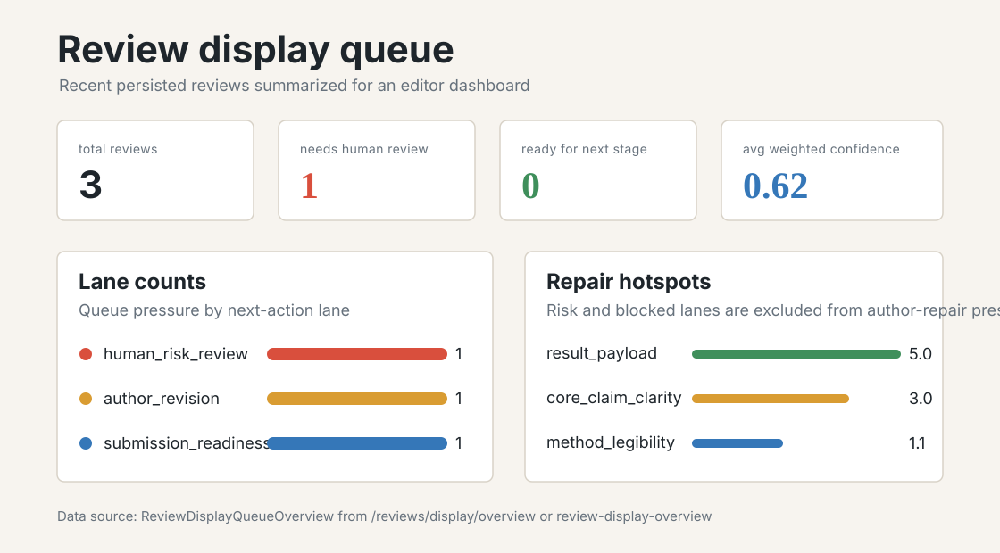
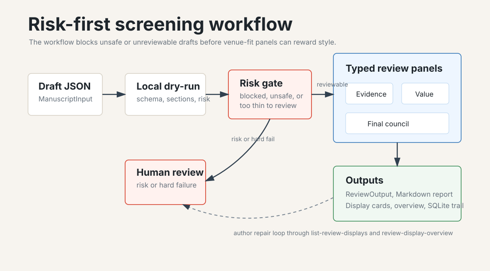
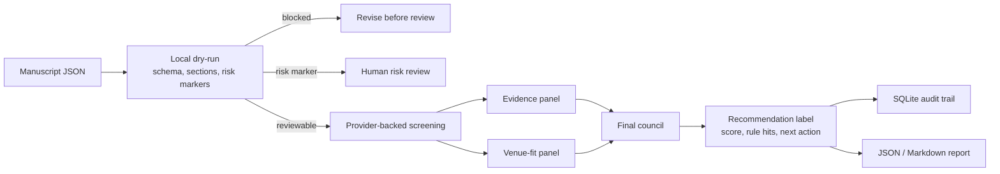
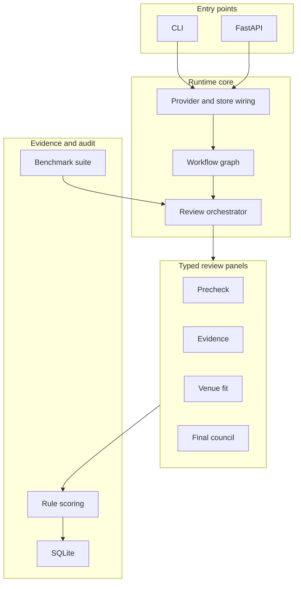

# glorious_mess_reviewer

Language: [中文](README_CN.md) | [English](README_EN.md)

glorious_mess_reviewer is a local-first screening desk for S.H.I.T / 构石-style submissions. It checks whether an absurd-academic manuscript is reviewable, whether the joke becomes an argument, whether safety issues need human review, and keeps an auditable SQLite record of each run.

## What This Repository Does

- Runs deterministic manuscript prechecks without an API key.
- Runs complete screening reviews through typed reviewer panels.
- Runs focused risk audits and venue-fit audits.
- Runs a fixture benchmark in offline or provider-backed mode and writes JSON/Markdown reports.
- Writes Markdown intake reports with stage flow, queue triage, gate checklist, confidence map, score groups, repair targets, score matrix, and revisions.
- Exposes lightweight review display projections, queue summaries, and queue overview counters with readiness gates, grouped score sections, venue-weighted repair targets, and queue triage.
- Stores review runs, workflow sessions, steps, artifacts, retries, and events in SQLite.
- Exposes the same workflow through a CLI and FastAPI.
- Provides built-in S.H.I.T screening presets and custom venue-profile validation.

## Product Preview





## Flow At A Glance





## Benchmark Snapshot

| Mode | Cases | Result |
| --- | --- | --- |
| `dry-run` | 7 fixture cases | `accepted_match_rate=1.0`, `risk_flags_match_rate=1.0` |
| provider-backed `review` | 1 fixture case | full workflow matched the expected recommendation; intake-only baseline did not; review reports include workflow/baseline delta diagnostics |

Start here:

- [README_CN.md](README_CN.md)
- [README_EN.md](README_EN.md)
- [docs/user-personas.md](docs/user-personas.md)
- [docs/api.md](docs/api.md)
- [docs/configuration.md](docs/configuration.md)

## Quick Check

```bash
pip install -e .[dev]
glorious_mess_reviewer doctor
glorious_mess_reviewer new-manuscript --output sample-manuscript.json
glorious_mess_reviewer review --input sample-manuscript.json --dry-run
glorious_mess_reviewer benchmark --mode dry-run --markdown-output benchmark-report.md
glorious_mess_reviewer list-review-displays --sort queue_priority
glorious_mess_reviewer list-review-displays --sort repair_priority --lane author_revision
glorious_mess_reviewer review-display-overview
```

Provider-backed benchmark runs are opt-in:

```bash
glorious_mess_reviewer review --input sample-manuscript.json --report-output intake-report.md
glorious_mess_reviewer benchmark --mode review --limit 1
```

## License

Apache-2.0
