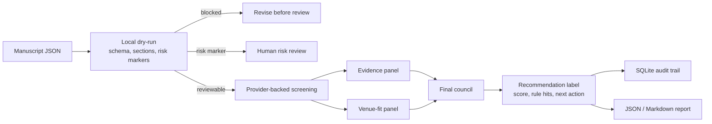
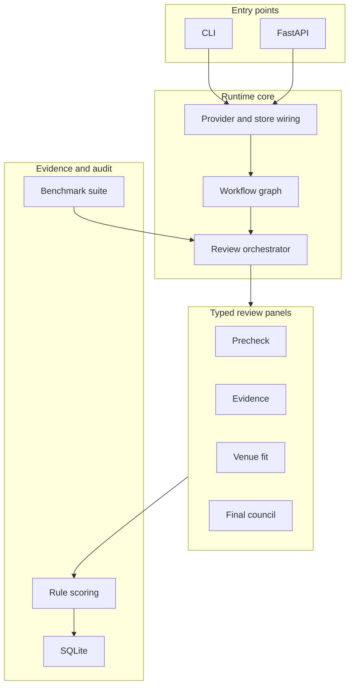

# glorious_mess_reviewer

`glorious_mess_reviewer` 是一个面向 S.H.I.T / 构石风格投稿的本地优先初筛工具。它把一篇荒诞学术风格稿件转成可复查的初筛记录：先做本地预检查，再由分工明确的评审面板判断结构、证据、整活质量、venue 适配度和风险边界，最后用规则评分给出推荐标签。

仓库名是 `glorious_mess_reviewer`，安装包和命令行入口是 `glorious_mess_reviewer`，Python 模块是 `glorious_mess_reviewer`。

## 这个仓库可以干嘛

- 检查稿件是否至少可评审：标题、摘要、正文、字数、必需章节和本地风险标记。
- 做完整初筛：输出 `ReviewOutput`，包含摘要、核心论点、12 个维度评分、规则命中、推荐标签和作者可读评审。
- 做风险审计：只关注安全、滥用、违法教程、骚扰等需要人工升级的内容。
- 做 venue fit 审计：判断稿件是不是 S.H.I.T / 构石语境下的“怪得有内容”，而不是只有标题和梗。
- 保存审计链路：SQLite 记录 review、workflow session、steps、artifacts、agent runs、retry records 和 events。
- 提供两个入口：CLI 适合本地操作，FastAPI 适合接入后台系统。
- 支持内置 preset 和自定义 `VenueProfile`。
- 暴露工作流图：`/workflows` 返回节点、条件边、并行组和 artifact key，便于外部后台展示和扩展。
- 运行离线或真实 provider benchmark，输出 JSON 和 Markdown 报告，用固定样本验证初筛有效性。
- 生成 Markdown intake report、轻量展示投影和 queue overview：包含 stage flow、queue triage、gate checklist、confidence map、score groups、按 venue 权重排序的 repair targets、score matrix、修订建议和后台队列压力摘要。

它不是最终录用系统，也不替代编辑判断。它解决的是第一轮 intake：先把“能不能评、有没有风险、值不值得进下一轮”讲清楚并留下证据。

## 展示预览


## 一眼看懂





## Benchmark 证据

| 模式 | 样本 | 结果 |
| --- | --- | --- |
| `dry-run` | 7 个 fixture case | `accepted_match_rate=1.0`，`risk_flags_match_rate=1.0` |
| provider-backed `review` | 1 个 fixture case | 完整工作流命中预期推荐；intake-only baseline 未命中；review report 会给出 workflow/baseline delta 诊断 |

## 适合谁用

| 用户 | 要解决的问题 | 推荐入口 |
| --- | --- | --- |
| 初筛编辑 | 批量判断稿件能否进入下一轮 | `review`、`list-review-displays`、`show-review-display` |
| 风险审核员 | 先排除安全、滥用或违法风险 | `risk-audit`、`/review/risk-audit` |
| 作者 / 投稿者 | 投稿前检查结构和 venue fit | `new-manuscript`、`review --dry-run` |
| 平台工程师 | 接入投稿后台或内部审核面板 | FastAPI `/review*`、`/workflow-sessions` |
| 口径维护者 | 调整 preset、评分规则和 prompt 模板 | `docs/venue-profile.md`、`scoring/`、`prompts/` |
| 开源采用者 | 评估测试、配置、迁移和查询边界是否足够稳定 | `doctor --require-provider`、`python -m pytest -q`、`docs/` |

更完整的用户画像见 [docs/user-personas.md](docs/user-personas.md)。

## 核心工作流

| 工作流 | 入口 | 输出 | 用途 |
| --- | --- | --- | --- |
| 完整初筛 | `review` / `POST /review` | `ReviewOutput` | 面板评审 + 规则评分 + 推荐标签 |
| 风险审计 | `risk-audit` / `POST /review/risk-audit` | `RiskAuditOutput` | 只看 intake 风险和阻断条件 |
| venue fit 审计 | `venue-fit-audit` / `POST /review/venue-fit-audit` | `VenueFitAuditOutput` | 只看 S.H.I.T 气质、整活质量和梗到论点的转换 |
| 本地预检查 | `review --dry-run` / `POST /review/dry-run` | `DryRunOutput` | 不调用 provider，检查 schema、章节、字数和本地风险标记 |

完整初筛采用风险优先路由：如果有效 precheck 已经发现风险标记，系统会跳过 evidence / value / meta 面板，直接生成需要人工风险复核的结构化 `ReviewOutput`。
推荐规则还会检查推进关键维度的 `confidence`：高分但低置信的 payload、evidence、core claim、meme-to-argument 或 overall merit 不会直接进入 full-review advance，而会留在人工复核或修订车道。

## S.H.I.T 场景映射

本项目把公开 S.H.*.T / 构石流程抽象成三段：

| 阶段 | 在本仓库中的含义 | 推荐入口 |
| --- | --- | --- |
| Petri Dish / 培养皿 | 想法或初稿是否具备基本结构 | `new-manuscript`、`review --dry-run` |
| Fermentation / 发酵区 | 进入初筛、风险审计和 venue fit 分诊 | `review`、`risk-audit`、`venue-fit-audit` |
| Real S.H.*.T / 构石 | 候选进入更深层人工评审或展示归档 | `show-review`、`show-workflow`、SQLite/API 查询 |

投稿轨道先放在 `metadata.submission_track`，例如 `rigorous_argument` 或 `joyful_zhenghuo`。这能兼容现有 `ManuscriptInput`，也给后续 report 页面留下展示字段。

## 推荐标签

| 标签 | 操作含义 |
| --- | --- |
| `ADVANCE_TO_FULL_REVIEW` | 进入下一轮人工或深度评审 |
| `ADVANCE_WITH_PAYLOAD_RESERVATIONS` | 可以进入下一轮，但需要重点检查 payload 密度 |
| `BORDERLINE_FOR_FULL_REVIEW` | 有 venue-native 价值，建议人工复核 |
| `REVISION_REQUIRED_BEFORE_REVIEW` | 先补结构、论点或证据，再进入下一轮 |
| `REJECT_AS_EMPTY_GIMMICK` | 有梗但空心，笑点没有转成论点 |
| `REJECT_AS_INCOHERENT_SLUDGE` | 结构或论证无法支撑评审 |
| `ESCALATE_FOR_HUMAN_RISK_CHECK` | 存在风险标记，必须人工安全复核 |

## 五分钟走通

### 1. 安装

```bash
py -3.11 -m venv .venv
.venv\Scripts\activate
pip install -e .[dev]
```

### 2. 检查本地状态

```bash
glorious_mess_reviewer doctor
```

未配置 provider 时，`doctor` 会返回 `status: degraded`，但 `dry_run_ready` 应该为 `true`。部署或 CI 里可以强制检查完整评审能力：

```bash
glorious_mess_reviewer doctor --require-provider
```

### 3. 生成一份输入模板

```bash
glorious_mess_reviewer new-manuscript --output sample-manuscript.json
```

### 4. 不调用 provider 先预检查

```bash
glorious_mess_reviewer review --input sample-manuscript.json --dry-run
```

### 5. 跑离线 benchmark

```bash
glorious_mess_reviewer benchmark --mode dry-run --markdown-output benchmark-report.md
```

### 6. 配置 provider 后运行完整初筛

```bash
set GLORIOUS_MESS_PROVIDER_BACKEND=openai
set OPENAI_API_KEY=your_key_here
set GLORIOUS_MESS_DEFAULT_MODEL=your_model_here
set GLORIOUS_MESS_DATABASE_PATH=glorious_mess_reviews.db

glorious_mess_reviewer review ^
  --input sample-manuscript.json ^
  --output review-output.json ^
  --report-output intake-report.md
```

轻量审计：

```bash
glorious_mess_reviewer risk-audit --input sample-manuscript.json
glorious_mess_reviewer venue-fit-audit --input sample-manuscript.json
```

真实 provider benchmark 需要显式开启：

```bash
glorious_mess_reviewer benchmark --mode review --limit 1 --markdown-output benchmark-review.md
```

### 7. 查询记录

```bash
glorious_mess_reviewer list-reviews
glorious_mess_reviewer list-review-displays
glorious_mess_reviewer list-review-displays --sort queue_priority --lane human_risk_review
glorious_mess_reviewer list-review-displays --sort repair_priority --lane author_revision
glorious_mess_reviewer review-display-overview
glorious_mess_reviewer list-workflow-sessions
glorious_mess_reviewer list-workflow-sessions --workflow-id screening.risk_audit.v1
glorious_mess_reviewer show-review --run-id <run_id>
glorious_mess_reviewer show-workflow --session-id <session_id>
```

## API

启动服务：

```bash
glorious_mess_reviewer serve
```

常用接口：

- `GET /health`
- `POST /review`
- `POST /review/dry-run`
- `POST /review/risk-audit`
- `POST /review/venue-fit-audit`
- `GET /reviews`
- `GET /reviews/display`
- `GET /reviews/display/overview`
- `GET /review/{run_id}/display`
- `GET /workflow-sessions`
- `GET /workflow/{session_id}`
- `GET /venue/default`
- `POST /venue/validate`

完整说明见 [docs/api.md](docs/api.md)。

## 输入格式

最小输入：

```json
{
  "manuscript_id": "my-submission-001",
  "title": "On the Queueing Theory of Shared Microwave Diplomacy",
  "abstract": "A short summary with a real claim.",
  "body": "Introduction\n...\nConclusion\n...\nLimitations\n..."
}
```

`manuscript_id` 会在校验前去掉首尾空白，去掉后不能为空。查询接口和 SQLite 审计记录都以这个稳定 ID 为准。

可选字段：

- `authors`
- `references`
- `venue_profile`
- `metadata`

自定义 venue 示例见 [docs/examples/custom-venue-profile.json](docs/examples/custom-venue-profile.json)。

## 数据保留

默认 SQLite 文件是 `glorious_mess_reviews.db`。它会保存请求 payload、评审输出、workflow session、steps、artifacts、event logs 和 agent logs。
数据库包含 `schema_metadata`，并为 review/workflow/event 查询建立索引；`workflow_sessions` 会单独保存 `manuscript_id`，方便后台按稿件追踪历史会话。

敏感稿件建议：

- 把 `GLORIOUS_MESS_DATABASE_PATH` 放在受控目录；
- 保持 `GLORIOUS_MESS_LOG_PROMPT_TEXT=false`；
- 如不需要 raw panel payload，设置 `GLORIOUS_MESS_STORE_RAW_AGENT_OUTPUTS=false`；
- 分享复现材料前删除本地数据库、`.env` 和任何 provider benchmark 输出。
- 匿名发布时不要打包 `.git/`，也不要带上本机 SQLite 运行产物。

## 文档

- [README_EN.md](README_EN.md)：英文 README
- [docs/user-personas.md](docs/user-personas.md)：用户画像和业务流程
- [docs/api.md](docs/api.md)：HTTP API
- [docs/configuration.md](docs/configuration.md)：配置
- [docs/benchmark.md](docs/benchmark.md)：离线和真实模型 benchmark
- [docs/venue-profile.md](docs/venue-profile.md)：preset 和推荐策略
- [docs/shit-review-playbook.md](docs/shit-review-playbook.md)：S.H.I.T 审稿口径
- [docs/shit-site-alignment.md](docs/shit-site-alignment.md)：S.H.*.T 站点对齐分析
- [CONTRIBUTING.md](CONTRIBUTING.md)：贡献指南
- [SECURITY.md](SECURITY.md)：安全策略

## 验证

```bash
python -m pytest -q
```

## License

Apache-2.0
