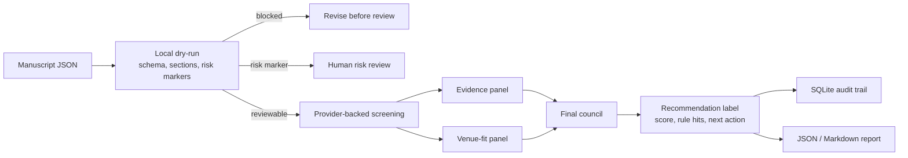
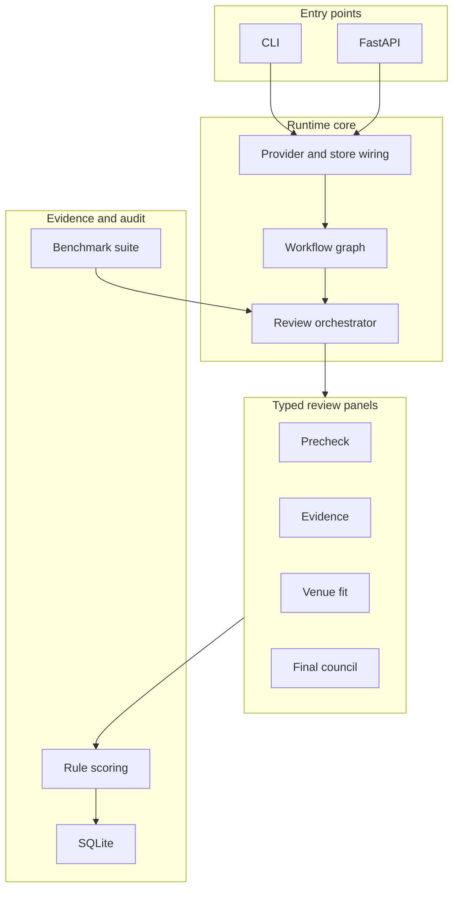

# glorious_mess_reviewer

`glorious_mess_reviewer` is a local-first screening desk for S.H.I.T / 构石-style submissions. It turns an absurd-academic manuscript into a reviewable record: local precheck first, then separate review panels for structure, evidence, payload, venue fit, and risk, followed by rule-based recommendation labels.

Repository name: `glorious_mess_reviewer`. Package and CLI name: `glorious_mess_reviewer`. Python module: `glorious_mess_reviewer`.

## What This Repository Can Do

- Check whether a manuscript is reviewable: title, abstract, body, length, required sections, and local risk markers.
- Run a complete screening review and return `ReviewOutput` with summary, claim, 12 rubric scores, rule hits, recommendation, and an author-facing review.
- Run a risk audit focused on unsafe, abusive, illegal, or escalation-worthy content.
- Run a venue-fit audit to decide whether a submission fits the S.H.I.T / 构石 style because the joke becomes an argument.
- Persist review history in SQLite: review runs, workflow sessions, steps, artifacts, agent runs, retry records, and events.
- Expose the same behavior through a CLI and FastAPI.
- Use built-in S.H.I.T presets or validate custom `VenueProfile` objects.
- Expose workflow graphs: `/workflows` returns nodes, conditional edges, parallel groups, and artifact keys for dashboards and extensions.
- Run offline or provider-backed benchmarks and write JSON/Markdown reports for fixed screening fixtures.
- Write Markdown intake reports, display projections, and queue overviews with stage flow, queue triage, gate checklist, confidence map, score groups, venue-weighted repair targets, score matrix, revisions, and dashboard pressure summaries.

This is not an acceptance system. It is an intake tool for answering three early questions: can this be reviewed, does it need risk review, and should it move to the next stage?

## Product Preview


## At A Glance





## Benchmark Evidence

| Mode | Cases | Result |
| --- | --- | --- |
| `dry-run` | 7 fixture cases | `accepted_match_rate=1.0`, `risk_flags_match_rate=1.0` |
| provider-backed `review` | 1 fixture case | full workflow matched the expected recommendation; intake-only baseline did not; review reports include workflow/baseline delta diagnostics |

## Who It Is For

| User | Problem | Entry Point |
| --- | --- | --- |
| Screening editor | Decide which manuscripts should move forward | `review`, `list-review-displays`, `show-review-display` |
| Risk reviewer | Separate unsafe or abusive content before venue-fit scoring | `risk-audit`, `/review/risk-audit` |
| Author | Check structure and venue fit before submission | `new-manuscript`, `review --dry-run` |
| Platform engineer | Integrate screening into a submission backend | FastAPI `/review*`, `/workflow-sessions` |
| Rubric maintainer | Tune presets, prompts, and scoring rules | `docs/venue-profile.md`, `scoring/`, `prompts/` |
| Open-source adopter | Evaluate tests, configuration, migrations, and query boundaries | `doctor --require-provider`, `python -m pytest -q`, `docs/` |

See [docs/user-personas.md](docs/user-personas.md) for the full product model.

## Workflows

| Workflow | Entry Point | Output | Use |
| --- | --- | --- | --- |
| Full screening | `review` / `POST /review` | `ReviewOutput` | Panel review, rule scoring, recommendation |
| Risk audit | `risk-audit` / `POST /review/risk-audit` | `RiskAuditOutput` | Intake risk and blocking conditions |
| Venue-fit audit | `venue-fit-audit` / `POST /review/venue-fit-audit` | `VenueFitAuditOutput` | S.H.I.T fit, execution quality, meme-to-argument conversion |
| Local precheck | `review --dry-run` / `POST /review/dry-run` | `DryRunOutput` | Schema, sections, length, and local risk checks without a provider |

Full screening uses risk-first routing: if the effective precheck already raises risk flags, the workflow skips evidence / value / meta panels and returns a structured `ReviewOutput` for human risk review.
Recommendation rules also inspect confidence on advancement-critical dimensions: high-score but low-confidence payload, evidence, core claim, meme-to-argument, or overall merit signals stay in a human-check or revision lane instead of moving straight to full-review advance.

## S.H.I.T Scenario Mapping

The project maps the public S.H.*.T / 构石 flow into three operational stages:

| Stage | Meaning in this repository | Entry Point |
| --- | --- | --- |
| Petri Dish / 培养皿 | Idea or draft intake before full review | `new-manuscript`, `review --dry-run` |
| Fermentation / 发酵区 | Screening, risk audit, and venue-fit triage | `review`, `risk-audit`, `venue-fit-audit` |
| Real S.H.*.T / 构石 | Candidate for deeper human review or archive display | `show-review`, `show-workflow`, SQLite/API queries |

Submission tracks live in `metadata.submission_track` for now, such as `rigorous_argument` or `joyful_zhenghuo`. This keeps `ManuscriptInput` backward-compatible while giving future report pages a stable display field.

## Recommendation Labels

| Label | Meaning |
| --- | --- |
| `ADVANCE_TO_FULL_REVIEW` | Move to the next review stage |
| `ADVANCE_WITH_PAYLOAD_RESERVATIONS` | Move forward, but inspect payload density closely |
| `BORDERLINE_FOR_FULL_REVIEW` | Worth a human look because venue-native value may be present |
| `REVISION_REQUIRED_BEFORE_REVIEW` | Fix structure, claim, or evidence before review |
| `REJECT_AS_EMPTY_GIMMICK` | The joke does not become an argument |
| `REJECT_AS_INCOHERENT_SLUDGE` | The structure or reasoning cannot support review |
| `ESCALATE_FOR_HUMAN_RISK_CHECK` | Risk flags require human safety review |

## Five-Minute Start

### 1. Install

```bash
py -3.11 -m venv .venv
.venv\Scripts\activate
pip install -e .[dev]
```

### 2. Check local readiness

```bash
glorious_mess_reviewer doctor
```

Without a provider, `doctor` should return `status: degraded` and `dry_run_ready: true`. For CI or deployment checks:

```bash
glorious_mess_reviewer doctor --require-provider
```

### 3. Create a starter manuscript payload

```bash
glorious_mess_reviewer new-manuscript --output sample-manuscript.json
```

### 4. Run precheck without a provider

```bash
glorious_mess_reviewer review --input sample-manuscript.json --dry-run
```

### 5. Run the offline benchmark

```bash
glorious_mess_reviewer benchmark --mode dry-run --markdown-output benchmark-report.md
```

### 6. Configure a provider and run full screening

```bash
set GLORIOUS_MESS_PROVIDER_BACKEND=openai
set OPENAI_API_KEY=your_key_here
set GLORIOUS_MESS_DEFAULT_MODEL=your_model_here
set GLORIOUS_MESS_DATABASE_PATH=glorious_mess_reviews.db

glorious_mess_reviewer review ^
  --input sample-manuscript.json ^
  --output review-output.json ^
  --report-output intake-report.md
```

Focused audits:

```bash
glorious_mess_reviewer risk-audit --input sample-manuscript.json
glorious_mess_reviewer venue-fit-audit --input sample-manuscript.json
```

Provider-backed benchmark runs are explicit:

```bash
glorious_mess_reviewer benchmark --mode review --limit 1 --markdown-output benchmark-review.md
```

### 7. Query records

```bash
glorious_mess_reviewer list-reviews
glorious_mess_reviewer list-review-displays
glorious_mess_reviewer list-review-displays --sort queue_priority --lane human_risk_review
glorious_mess_reviewer list-review-displays --sort repair_priority --lane author_revision
glorious_mess_reviewer review-display-overview
glorious_mess_reviewer list-workflow-sessions
glorious_mess_reviewer list-workflow-sessions --workflow-id screening.risk_audit.v1
glorious_mess_reviewer show-review --run-id <run_id>
glorious_mess_reviewer show-workflow --session-id <session_id>
```

## API

Start the service:

```bash
glorious_mess_reviewer serve
```

Common routes:

- `GET /health`
- `POST /review`
- `POST /review/dry-run`
- `POST /review/risk-audit`
- `POST /review/venue-fit-audit`
- `GET /reviews`
- `GET /reviews/display`
- `GET /reviews/display/overview`
- `GET /review/{run_id}/display`
- `GET /workflow-sessions`
- `GET /workflow/{session_id}`
- `GET /venue/default`
- `POST /venue/validate`

See [docs/api.md](docs/api.md) for request and response details.

## Input Shape

Minimal input:

```json
{
  "manuscript_id": "my-submission-001",
  "title": "On the Queueing Theory of Shared Microwave Diplomacy",
  "abstract": "A short summary with a real claim.",
  "body": "Introduction\n...\nConclusion\n...\nLimitations\n..."
}
```

`manuscript_id` is trimmed before validation and must not be blank after trimming. Query APIs and SQLite audit records use this normalized identifier.

Optional fields:

- `authors`
- `references`
- `venue_profile`
- `metadata`

See [docs/examples/custom-venue-profile.json](docs/examples/custom-venue-profile.json) for a custom venue example.

## Data Retention

The default SQLite file is `glorious_mess_reviews.db`. It stores request payloads, review outputs, workflow sessions, steps, artifacts, event logs, and agent logs.
The database stores `schema_metadata`, query indexes, and a dedicated `workflow_sessions.manuscript_id` column so external dashboards can browse sessions by manuscript.

For sensitive manuscripts:

- Put `GLORIOUS_MESS_DATABASE_PATH` in a controlled directory.
- Keep `GLORIOUS_MESS_LOG_PROMPT_TEXT=false`.
- Set `GLORIOUS_MESS_STORE_RAW_AGENT_OUTPUTS=false` if raw panel payloads should not be retained.
- Remove local databases, `.env` files, and provider benchmark outputs before sharing repro material.
- For anonymous distribution, do not bundle `.git/` or local SQLite runtime artifacts.

## Documentation

- [README_CN.md](README_CN.md): Chinese README
- [docs/user-personas.md](docs/user-personas.md): Personas and workflows
- [docs/api.md](docs/api.md): HTTP API
- [docs/configuration.md](docs/configuration.md): Configuration
- [docs/benchmark.md](docs/benchmark.md): Offline and provider-backed benchmark
- [docs/venue-profile.md](docs/venue-profile.md): Presets and recommendation policy
- [docs/shit-review-playbook.md](docs/shit-review-playbook.md): S.H.I.T review style guide
- [docs/shit-site-alignment.md](docs/shit-site-alignment.md): S.H.*.T site alignment notes
- [CONTRIBUTING.md](CONTRIBUTING.md): Contribution guide
- [SECURITY.md](SECURITY.md): Security policy

## Validation

```bash
python -m pytest -q
```

## License

Apache-2.0
